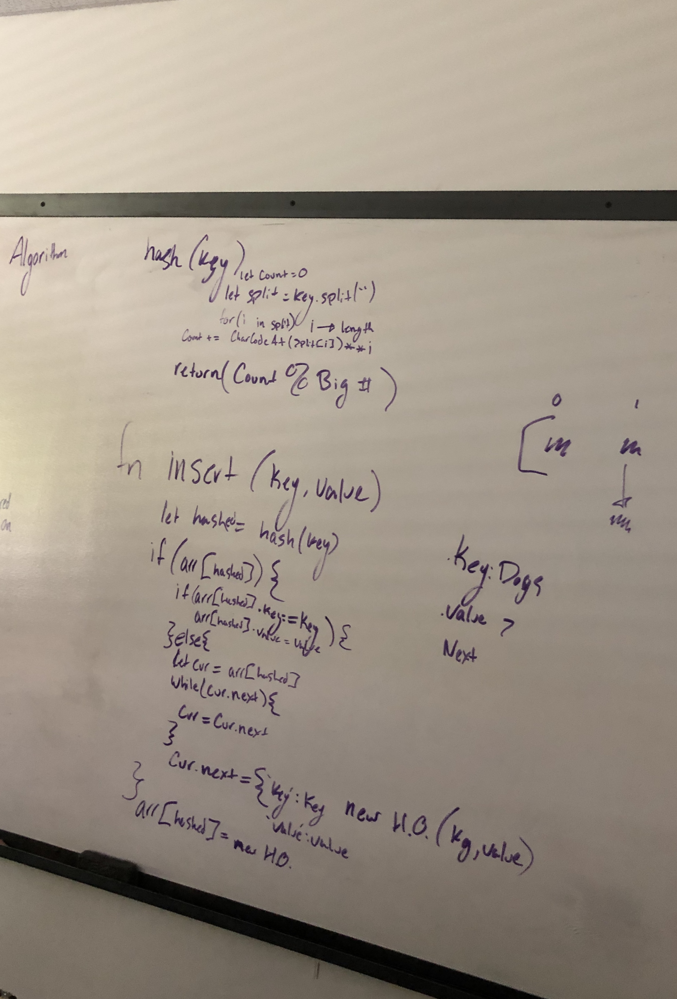

# hashtables
data-structures-and-algorithms

## Challenge
Implement a Hashtable with the following methods:

## Approach & Efficiency
1. add: takes in both the key and value. This method should hash the key, and add the key and value pair to the table, handling collisions as needed.
2. get: takes in the key and returns the value from the table.
3. contains: takes in the key and returns a boolean, indicating if the key exists in the table already.
4. hash: takes in an arbitrary key and returns an index in the collection.

## Solution

